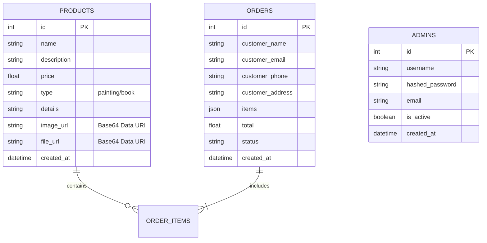

# 🎨 Diamaru Store - Tienda de Cuadros y Libros PDF

Plataforma ecommerce moderna para la venta de **cuadros digitales** y **libros en formato PDF**. Aplicación full-stack desarrollada con **React + Vite** (frontend) y **Python FastAPI** (backend), con diseño completamente responsivo y funcionalidad de administración.

---

## 📋 Tabla de Contenidos

1. [Características](#-características)
2. [Tech Stack](#-tech-stack)
3. [Estructura del Proyecto](#-estructura-del-proyecto)
4. [Instalación](#-instalación)
5. [Ejecución](#-ejecución)
6. [Endpoints API](#-endpoints-api)
7. [Funcionalidades](#-funcionalidades)
8. [Panel de Administración](#-panel-de-administración)
9. [Diseño Responsivo](#-diseño-responsivo)
10. [Base de Datos](#-base-de-datos)
11. [Sistema de Upload](#-sistema-de-upload)

---

## ✨ Características

### Frontend
- ✅ **Catálogo de Productos**: Visualización de cuadros y libros PDF
- ✅ **Filtros Avanzados**: Filtra por tipo (cuadros/libros)
- ✅ **Carrito Persistente**: Almacenamiento en localStorage
- ✅ **Detalle de Productos**: Vistas completas con información detallada
- ✅ **Checkout Seguro**: Formulario de compra con validación
- ✅ **Diseño Responsive**: 320px a 1920px (7+ breakpoints)
- ✅ **Interfaz Moderna**: Gradientes, animaciones suaves, UI/UX optimizada

### Backend
- ✅ **API RESTful** completa con FastAPI
- ✅ **Autenticación JWT**: Sistema seguro para admin
- ✅ **Gestión de Órdenes**: Procesamiento y almacenamiento
- ✅ **Upload de Imágenes**: Para cuadros (máx 5MB)
- ✅ **Upload de PDFs**: Para libros (máx 50MB)
- ✅ **CORS Habilitado**: Acceso desde múltiples orígenes
- ✅ **Base de Datos SQLite**: Almacenamiento persistente
- ✅ **Validación de Datos**: Con Pydantic schemas

---

## 🛠️ Tech Stack

### Frontend
| Tecnología | Versión | Propósito |
|-----------|---------|----------|
| React | 18.x | Framework UI |
| Vite | 4.5.14 | Build tool y dev server |
| React Router | 6.x | Routing y navegación |
| Axios | Latest | Cliente HTTP |
| CSS3 | 2023 | Estilos responsivos |
| JavaScript (ES6+) | Modern | Lógica de aplicación |

### Backend
| Tecnología | Versión | Propósito |
|-----------|---------|----------|
| Python | 3.9+ | Lenguaje |
| FastAPI | 0.128.2 | Framework web |
| SQLAlchemy | 2.0.46 | ORM |
| SQLite | Latest | Base de datos |
| Pydantic | Latest | Validación |
| python-jose | Latest | JWT |
| python-multipart | Latest | Upload de archivos |
| argon2-cffi | Latest | Hash de contraseñas |

---

## 📁 Estructura del Proyecto

```
Diamaru.store/
│
├── 📄 package.json                          # Dependencies Node.js
├── 📄 index.html                            # HTML principal
├── 📄 vite.config.js                        # Config de Vite
├── 📄 .env                                  # Variables de entorno
├── 📄 README.md                             # Documentación completa
│
├── 🚀 Scripts de Inicio
│   ├── start.bat                            # Windows CMD
│   └── start.ps1                            # Windows PowerShell
│
├── 📁 src/                                  # ⚛️ CÓDIGO FRONTEND
│   ├── 📄 main.jsx                          # Punto de entrada
│   ├── 📄 App.jsx                           # Componente raíz
│   ├── 📄 App.css                           # Estilos generales
│   ├── 📄 index.css                         # Estilos globales + media queries
│   │
│   ├── 📁 components/                       # 🧩 Componentes Reutilizables
│   │   ├── Navbar.jsx                       # Barra de navegación
│   │   ├── Navbar.css                       # Estilos sidebar
│   │   ├── ProductCard.jsx                  # Tarjeta de producto
│   │   ├── ProductCard.css                  # Estilos tarjeta
│   │   └── admin/                           # Componentes Admin
│   │       ├── ProductForm.jsx              # Formulario crear/editar
│   │       ├── ProductForm.css
│   │       ├── ProductList.jsx              # Tabla de productos
│   │       ├── ProductList.css
│   │       ├── AdminStats.jsx               # Estadísticas
│   │       └── AdminStats.css
│   │
│   ├── 📁 pages/                            # 📄 Páginas Principales
│   │   ├── Home.jsx                         # Inicio
│   │   ├── Home.css
│   │   ├── Products.jsx                     # Catálogo con filtros
│   │   ├── Products.css
│   │   ├── ProductDetail.jsx                # Detalle producto
│   │   ├── ProductDetail.css
│   │   ├── Cart.jsx                         # Carrito
│   │   ├── Cart.css
│   │   ├── Checkout.jsx                     # Compra
│   │   ├── Checkout.css
│   │   ├── AdminLogin.jsx                   # Login admin
│   │   ├── AdminLogin.css
│   │   ├── AdminDashboard.jsx               # Panel admin
│   │   └── AdminDashboard.css
│   │
│   └── 📁 services/                         # 🔌 API & Servicios
│       └── api.js                           # Cliente Axios
│
├── 📁 backend/                              # 🐍 CÓDIGO FASTAPI
│   ├── 📄 main.py                           # Servidor FastAPI
│   ├── 📄 config.py                         # Configuración
│   ├── 📄 database.py                       # Setup DB
│   ├── 📄 security.py                       # JWT seguridad
│   ├── 📄 create_admin.py                   # Script crear admin
│   ├── 📄 requirements.txt                  # Dependencias Python
│   ├── 📄 .env.example
│   │
│   ├── 📁 app/                              # 📦 Aplicación FastAPI
│   │   ├── 📄 __init__.py                   # App FastAPI + CORS
│   │   ├── 📄 schemas.py                    # Validación Pydantic
│   │   ├── 📄 schemas_admin.py              # Schemas admin
│   │   │
│   │   ├── 📁 models/                       # 🗄️ Modelos ORM
│   │   │   ├── product.py                   # Clase Product
│   │   │   ├── order.py                     # Clase Order
│   │   │   └── admin.py                     # Clase Admin
│   │   │
│   │   └── 📁 routes/                       # 🛣️ Endpoints API
│   │       ├── products.py                  # GET /products*
│   │       ├── orders.py                    # POST /orders*
│   │       ├── auth.py                      # POST /auth/admin/login
│   │       └── admin.py                     # POST /admin/*
│   │
│   ├── 📁 uploads/                          # 📤 Archivos subidos
│   │   ├── products/                        # Imágenes de cuadros
│   │   └── books/                           # PDFs de libros
│   │
│   └── 📁 venv/                             # 🐍 Entorno virtual Python

└── 📄 test.db                               # 💾 Base de datos SQLite
```

---

## 🚀 Instalación

### Requisitos Previos
- **Node.js** 16+ (para frontend)
- **Python** 3.9+ (para backend)
- **Git** (para clonar el proyecto)

### Opción 1: Instalación Automática (Recomendado)

#### Windows (PowerShell)
```powershell
.\start.ps1
```

#### Windows (CMD)
```cmd
start.bat
```

Esto instalará automáticamente todo lo necesario.

### Opción 2: Instalación Manual

#### Frontend

```bash
# Instalar dependencias Node.js
npm install

# Opcional: Instalar dependencias de desarrollo
npm install --save-dev
```

#### Backend

```bash
# Navegar a carpeta backend
cd backend

# Crear entorno virtual (si no existe)
python -m venv venv

# Activar entorno virtual
# Windows:
venv\Scripts\activate
# macOS/Linux:
source venv/bin/activate

# Instalar dependencias Python
pip install -r requirements.txt
```

---

## ▶️ Ejecución

### Opción 1: Scripts Automáticos

#### Windows PowerShell
```powershell
.\start.ps1
```

#### Windows CMD
```cmd
start.bat
```

### Opción 2: Ejecución Manual

#### Terminal 1 - Frontend
```bash
npm run dev
# Frontend en http://localhost:3000
```

#### Terminal 2 - Backend
```bash
cd backend
python main.py
# Backend en http://localhost:8000
```

### Verificación

Ambos servicios deben estar activos:
- ✅ **Frontend**: http://localhost:3000
- ✅ **Backend**: http://localhost:8000/health
- ✅ **Admin**: http://localhost:3000/admin

**Credenciales Admin**:
- Usuario: `admin`
- Contraseña: `admin123`

---

## 📡 Endpoints API

### Productos
```
GET  /api/products              # Obtener todos
GET  /api/products?type=painting # Filtrar por tipo
GET  /api/products/{id}         # Obtener uno
```

### Órdenes
```
POST /orders                     # Crear orden
GET  /orders                     # Obtener todas
GET  /orders/{id}                # Obtener una
```

### Admin (Requiere JWT Token)
```
POST   /auth/admin/login         # Autenticarse
GET    /admin/products           # Listar con auth
POST   /admin/products           # Crear producto
PUT    /admin/products/{id}      # Editar
DELETE /admin/products/{id}      # Eliminar
GET    /admin/stats              # Estadísticas
POST   /admin/upload-image       # Upload imagen
POST   /admin/upload-book        # Upload PDF
```

### Sistema
```
GET  /                           # Información API
GET  /health                     # Estado servidor
```

---

## 🎯 Funcionalidades

### Para Clientes

#### Home `/`
- Hero section con call-to-action
- Características destacadas
- Links a catálogo

#### Productos `/products`
- Grid responsivo de productos
- Filtros por tipo (cuadros/libros)
- Búsqueda rápida
- Ordenamiento

#### Detalle de Producto `/product/:id`
- Galería de imágenes
- Información completa
- Selector de cantidad
- Agregar al carrito
- Información de envío

#### Carrito `/cart`
- Listado de artículos
- Modificar cantidades
- Eliminar productos
- Cálculo de subtotal
- Botón ir a checkout
- Carrito vacío

#### Checkout `/checkout`
- Formulario información personal
- Dirección de envío
- Información de pago
- Resumen del pedido
- Procesar compra

### Para Administradores

#### Login Admin `/admin/login`
- Autenticación con JWT
- Validación de credenciales
- Almacenamiento de token

#### Dashboard Admin `/admin`

**Pestaña: Estadísticas**
- Total de productos
- Total de órdenes
- Total de ventas
- Productos más vendidos

**Pestaña: Productos**
- Tabla con todos los productos
- Acciones: Editar, Eliminar
- Información: ID, Nombre, Tipo, Precio
- Búsqueda y filtrado

**Pestaña: Agregar Producto**
- Formulario completo
- Nombre del producto
- Descripción detallada
- Categoría (Cuadro/Libro)
- Precio
- Detalles adicionales
- Upload de imagen (JPG/PNG)
- Upload de PDF (para libros)
- Validación de campos

---

## 🔐 Panel de Administración

### Características Implementadas

1. **Autenticación Segura**
   - JWT tokens con expiracion
   - Contraseñas hasheadas con argon2
   - Protección de rutas

2. **Gestión de Productos**
   - Crear nuevos productos
   - Editar existentes
   - Eliminar productos
   - Vista previa de imágenes
   - Validación de formularios

3. **Sistema de Upload**
   - Imágenes: máximo 5MB (JPG, PNG, GIF)
   - PDFs: máximo 50MB
   - Almacenamiento seguro
   - Nombres de archivo únicos (UUID)

4. **Estadísticas**
   - Total de productos
   - Total de órdenes
   - Ingresos totales
   - Productos por categoría

5. **Interfaz Segura**
   - Token almacenado en localStorage
   - Logout automático
   - Sesión persistente
   - Redirección a login si no autenticado

### Acceso

```
URL: http://localhost:3000/admin
Usuario: admin
Contraseña: admin123
```

---

## 📱 Diseño Responsivo

La aplicación está **completamente optimizada** para todos los dispositivos con 7+ breakpoints CSS.

### Breakpoints Implementados

| Dispositivo | Rango | Breakpoint CSS |
|-----------|-------|----------------|
| **XS** | 320px | `max-width: 320px` |
| **S** | 375-480px | `max-width: 480px` |
| **M** | 480-768px | `max-width: 768px` |
| **L** | 768-1024px | `max-width: 1024px` |
| **XL** | 1024-1440px | `max-width: 1440px` |
| **2XL** | 1440-1920px | `max-width: 1920px` |
| **3XL** | 1920px+ | Desktop completo |

### Optimizaciones por Dispositivo

#### Mobile (320px - 480px)
```
┌──────────────┐
│ LOGO   🛒 ☰ │  ← Navbar compacta
├──────────────┤
│ [Logo]       │  ← Hi-res image
├──────────────┤
│ [Producto]   │  ← Grid 2 columnas
│ [Producto]   │
├──────────────┤
│ [Producto]   │
│ [Producto]   │
└──────────────┘
```

**Cambios CSS**:
- Navbar altura 56px (vs 70px desktop)
- Grid 2 columnas (vs 4-5)
- Fuentes 12-14px (vs 16px)
- Padding 8-12px (vs 20px)
- Botones ancho completo
- Imágenes altura 150px (vs 200px)

#### Tablet (768px - 1024px)
```
┌──────────────────┐
│ LOGO  Nav  🛒    │  ← Navbar normal
├──────────────────┤
│ [Prod] [Prod]    │  ← Grid 3 columnas
│ [Prod] [Prod]    │
├──────────────────┤
│ [Prod] [Prod]    │
└──────────────────┘
```

**Cambios CSS**:
- Navbar altura 60px
- Grid 3 columnas
- Fuentes 14-15px
- Padding 15-16px
- Imágenes altura 190px

#### Desktop (1024px+)
```
┌────────────────────────────────┐
│ LOGO      Nav Links   Search  🛒 │  ← Navbar completa
├────────────────────────────────┤
│ [Prod] [Prod] [Prod] [Prod]    │  ← Grid 4-5 columnas
│ [Prod] [Prod] [Prod] [Prod]    │
├────────────────────────────────┤
│ [Prod] [Prod] [Prod] [Prod]    │
└────────────────────────────────┘
```

**Características**:
- Navbar altura 70px
- Grid 4-5 columnas (250px min-width)
- Fuentes 16-18px
- Padding 20px
- Imágenes altura 200px
- Hover effects sutiles

### Componentes Responsivos

| Componente | Desktop | Tablet | Mobile | XS |
|-----------|---------|--------|--------|-----|
| **Navbar** | 70px | 60px | 56px | 48px |
| **Grid** | 4-5 col | 3 col | 2 col | 2 col |
| **Card** | 200px | 190px | 150px | 120px |
| **Fuentes** | 16px | 14px | 12px | 11px |
| **Padding** | 20px | 16px | 12px | 8px |

---

## 💾 Base de Datos

### Tecnología
- **SQLite** (archivo `test.db`)
- ORM: **SQLAlchemy**
- Migrations: Automáticas con Alembic

### Modelo Relacional



### Esquemas de Datos

#### Tabla: Products
```sql
CREATE TABLE products (
  id               INTEGER PRIMARY KEY,
  name             VARCHAR NOT NULL,
  description      VARCHAR,
  price            FLOAT NOT NULL,
  type             VARCHAR,  -- "painting" o "book"
  details          VARCHAR,
  image_url        VARCHAR,  -- Almacenado como Base64 Data URI
  file_url         VARCHAR,  -- Almacenado como Base64 Data URI (PDF)
  created_at       DATETIME
);
```

#### Tabla: Orders
```sql
CREATE TABLE orders (
  id               INTEGER PRIMARY KEY,
  customer_name    VARCHAR NOT NULL,
  customer_email   VARCHAR NOT NULL,
  customer_phone   VARCHAR,
  customer_address VARCHAR,
  items            JSON,  -- [{id, name, quantity, price}]
  total            FLOAT NOT NULL,
  status           VARCHAR,  -- "pending", "completed"
  created_at       DATETIME
);
```

#### Tabla: Admins
```sql
CREATE TABLE admins (
  id               INTEGER PRIMARY KEY,
  username         VARCHAR UNIQUE,
  hashed_password  VARCHAR,
  email            VARCHAR,
  is_active        BOOLEAN,
  created_at       DATETIME
);
```

### Relaciones
- **Productos - Órdenes**: Relación N:M gestionada a través del campo JSON `items` en la tabla `Orders`, que almacena una instantánea de los productos al momento de la compra.
- **Admins**: Tabla independiente para gestión de acceso al panel de control.

---

## 📤 Sistema de Upload

### Almacenamiento en Base de Datos
El proyecto implementa un sistema moderno de almacenamiento donde los archivos (imágenes y PDFs) se convierten a **Base64** y se guardan directamente en la base de datos SQLite. Esto facilita la portabilidad y backup del proyecto.

### Imágenes de Cuadros

**Endpoint**: `POST /admin/upload-image`

Procesa la imagen y retorna un Data URI listo para ser usado en etiquetas ``.

**Requisitos**:
- Formato: JPG, PNG, GIF, WEBP
- Retorno: String Base64 (ej: `data:image/jpeg;base64,/9j/4AAQ...`)

### PDFs de Libros

**Endpoint**: `POST /admin/upload-book`

Procesa el archivo PDF y retorna un Data URI para almacenamiento.

**Requisitos**:
- Formato: PDF únicamente
- Retorno: String Base64 (ej: `data:application/pdf;base64,JVBERi...`)

### Validación en Frontend

```javascript
// Validar imagen
const validateImage = (file) => {
  const validTypes = ['image/jpeg', 'image/png', 'image/gif'];
  const maxSize = 5 * 1024 * 1024; // 5MB
  
  if (!validTypes.includes(file.type)) {
    throw new Error('Solo JPG, PNG, GIF');
  }
  if (file.size > maxSize) {
    throw new Error('Máximo 5MB');
  }
};

// Validar PDF
const validatePDF = (file) => {
  const maxSize = 50 * 1024 * 1024; // 50MB
  
  if (file.type !== 'application/pdf') {
    throw new Error('Solo archivos PDF');
  }
  if (file.size > maxSize) {
    throw new Error('Máximo 50MB');
  }
};
```

---

## 🎨 Estilos y Temas

### Paleta de Colores
```css
:root {
  --primary-color: #8b5cf6;      /* Violeta */
  --secondary-color: #ec4899;    /* Rosa */
  --success-color: #10b981;      /* Verde */
  --danger-color: #ef4444;       /* Rojo */
  --bg-color: #f9fafb;           /* Gris claro */
  --text-color: #1f2937;         /* Gris oscuro */
  --border-color: #e5e7eb;       /* Gris borde */
}
```

### Tipografía
- **Familia**: -apple-system, BlinkMacSystemFont, 'Segoe UI', Roboto, sans-serif
- **Tamaños**: 11px (XS) → 48px (H1 Desktop)
- **Espaciado**: 1.5x line-height para legibilidad

### Efectos
- **Gradientes**: Linear 135deg para cards y headers
- **Sombras**: 0 1px 3px rgba(0,0,0,0.1) estándar
- **Transiciones**: 0.3s ease para hover effects
- **Animaciones**: Float 3s para emojis

---

## 🔒 Seguridad

### Backend
- ✅ CORS habilitado solo para localhost
- ✅ JWT para autenticación admin
- ✅ Passwords hasheadas con argon2
- ✅ Validación con Pydantic
- ✅ SQL injection prevención (SQLAlchemy ORM)

### Frontend
- ✅ Token almacenado en localStorage
- ✅ Validación de inputs en formularios
- ✅ Sanitización de datos
- ✅ HTTPS listo para producción

---

## 📊 Scripts Disponibles

### Package.json (Frontend)
```bash
npm run dev       # Dev server con hot reload
npm run build     # Build producción
npm run preview   # Preview de build
npm run lint      # Ejecutar linter (si existe)
```

### Python (Backend)
```bash
python main.py           # Inicia servidor FastAPI
python create_admin.py   # Crea cuenta admin
cd backend && python main.py
```

---

## 🚀 Despliegue

### Frontend (Vercel/Netlify)
1. Hacer build: `npm run build`
2. Subir carpeta `dist/`
3. Configurar variables de entorno

### Backend (Heroku/Railway)
1. Crear `Procfile`: `web: gunicorn main:app`
2. Configurar vars de entorno
3. Hacer push a repositorio
4. Deploy automático

### Docker (Opcional)

**Dockerfile Frontend**:
```dockerfile
FROM node:18-alpine
WORKDIR /app
COPY package.json .
RUN npm install
COPY . .
RUN npm run build
CMD ["npm", "run", "preview"]
```

**Dockerfile Backend**:
```dockerfile
FROM python:3.10-slim
WORKDIR /app
COPY requirements.txt .
RUN pip install -r requirements.txt
COPY . .
CMD ["python", "main.py"]
```

---

## 🐛 Troubleshooting

### "Port already in use"
```bash
# Matar procesos Python
taskkill /F /IM python.exe  # Windows

# Matar procesos Node
taskkill /F /IM node.exe    # Windows
```

### "ModuleNotFoundError: No module named 'fastapi'"
```bash
cd backend
pip install -r requirements.txt
```

### "npm: command not found"
Instalar Node.js desde https://nodejs.org

### CORS Error desde frontend
Verificar que backend esté en puerto 8000 y CORS está habilitado

---

## 📞 Soporte y Contribuciones

### Reporte de Issues
1. Describe el problema detalladamente
2. Proporciona pasos para reproducir
3. Incluye captura de pantalla si aplica
4. Especifica versión de navegador/Python

### Pull Requests
1. Fork el proyecto
2. Crea rama: `git checkout -b feature/nombre`
3. Commit cambios: `git commit -m "Add feature"`
4. Push: `git push origin feature/nombre`
5. Abre PR con descripción

---

## 📝 Notas Importantes

### Almacenamiento de Archivos
- Las imágenes se guardan en `backend/uploads/products/`
- Los PDFs se guardan en `backend/uploads/books/`
- Los URLs en DB son relativos (ej: `/uploads/products/uuid.jpg`)
- El frontend accede vía URLs relativas

### Persistencia de Carrito
- El carrito se guarda en `localStorage`
- Persiste entre sesiones de navegador
- Se limpia al vaciar manualmente

### Base de Datos
- SQLite se crea automáticamente en `backend/test.db`
- No se necesita configuración adicional
- Para resetear: eliminar `test.db` y reiniciar

### Credenciales por Defecto
```
Admin:
- Usuario: admin
- Contraseña: admin123
```
⚠️ **Cambiar en producción**

---

## 📄 Licencia

MIT License - Libre para uso comercial y personal

---

## ✅ Checklist de Funcionalidades

- [x] Frontend React + Vite
- [x] Backend FastAPI
- [x] Carrito de compras
- [x] Sistema de órdenes
- [x] Panel de admin
- [x] Autenticación JWT
- [x] Upload de imágenes
- [x] Upload de PDFs
- [x] Diseño responsivo (320px - 1920px)
- [x] Base de datos SQLite
- [x] CORS habilitado
- [x] Validación de datos
- [x] Hashing de contraseñas
- [x] Almacenamiento persistente

---

**Desarrollado con ❤️ para Diamaru Store**

**Última actualización**: 5 de febrero de 2026

**Estado**: ✅ Completamente funcional y responsivo
